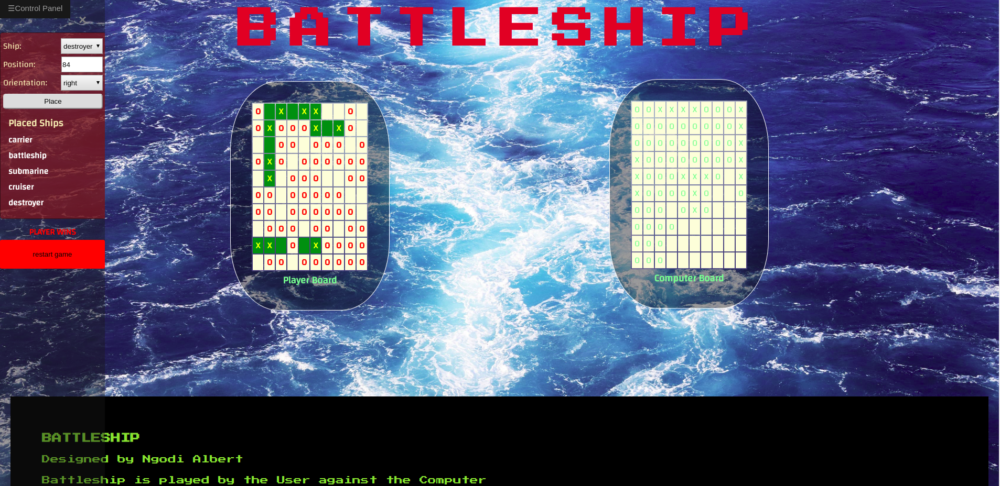

Battleship
==========

Battleship is a game played on the browser between a user and the computer. The game starts with both users manually placing their ships on their respective Gameboards(a grid of squares). The ships are shot by the opponent in-turn with the objective to hit the full length of a ship and all the other ships. A missed shot is marked by a circle(O) on the gameboard and a hit is marked by a cross(X) on the gameboard and on the hit ship as well. The game ends when all the ships on a given gameboard have all been hit; they are said to be sunk, the opponent is then declared winner.

Technologies and Tools used
---------------------------

*   Node
*   NPM
*   ES6 Javascript
*   HTML
*   CSS3
*   WEBPACK
*   ES6 MODULES
*   JEST TESTING

Future features
---------------
*   A counter for each player's number of missed hits
*   A game between 2 users
*   Sound and  visual effects for actions such as hits, miss, sinking, and much more.

[Live Demo](https://battleship-js.netlify.com/)

Installation & Usage
--------------------

Clone the repository to your local machine

$git clone git@github.com:ngodi/battleship-game.git

cd into the directory, install dependencies, start(build and run)

$ cd battleship-game $ npm install $ webpack open dist/index.html to the browser

Testing
-------
$npm run test

Author
------
Ngodi albert
- Github: [@ngodi](https://github.com/ngodi)
- Twitter: [@albertngodi](https://twitter.com/albertngodi)
- Linkedin: [linkedin](https://www.linkedin.com/in/albertngodi/)
